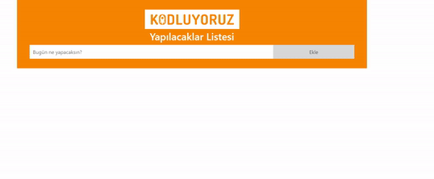
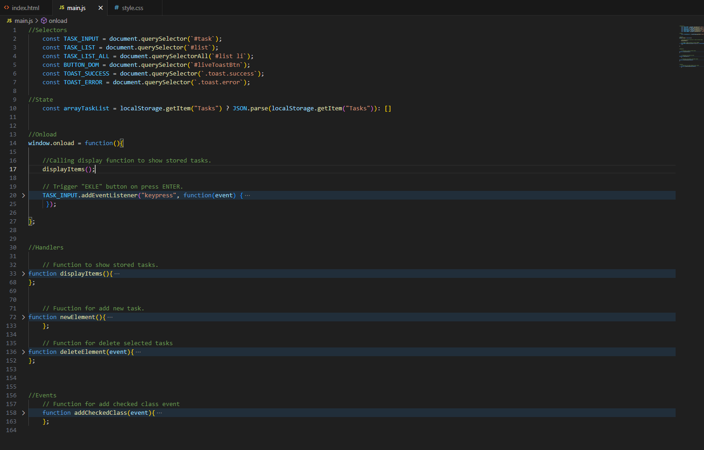
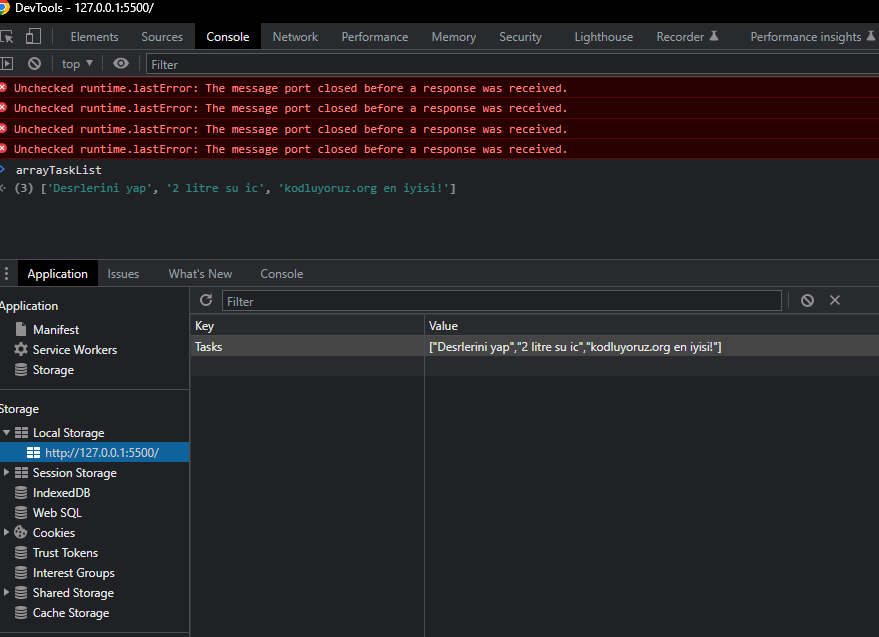

# Kodluyoruz.org Todo-List

Projeyi hiç bir destek almadan sadece dökümantasyonlardan araştırarak oluşturdum. Bazı kodların eminim daha kolay bir kullanım şekli vardı fakat ben kendi mantığımı yürüterek oluşturdum ve projeyi oluştururken öğrenmediğim hiçbir bilgiyi kullanmadım. Ödevde istenilen tüm fonksiyonlar sorunsuz çalışıyor. Benim için çok keyifli bir proje oldu. Umarım inceleyen arkadaşlar beğenirler.

> Kodları olabildiğince açıklamalı yaptım. NOT: Açıklamalar ingilizce. İngilizce bilmeyen arkadaşlar umarım zorlanmazsınız.

 > Oluşturulan tasklar dinamik olarak array ve localstorage içerisinde tutulur.
 

